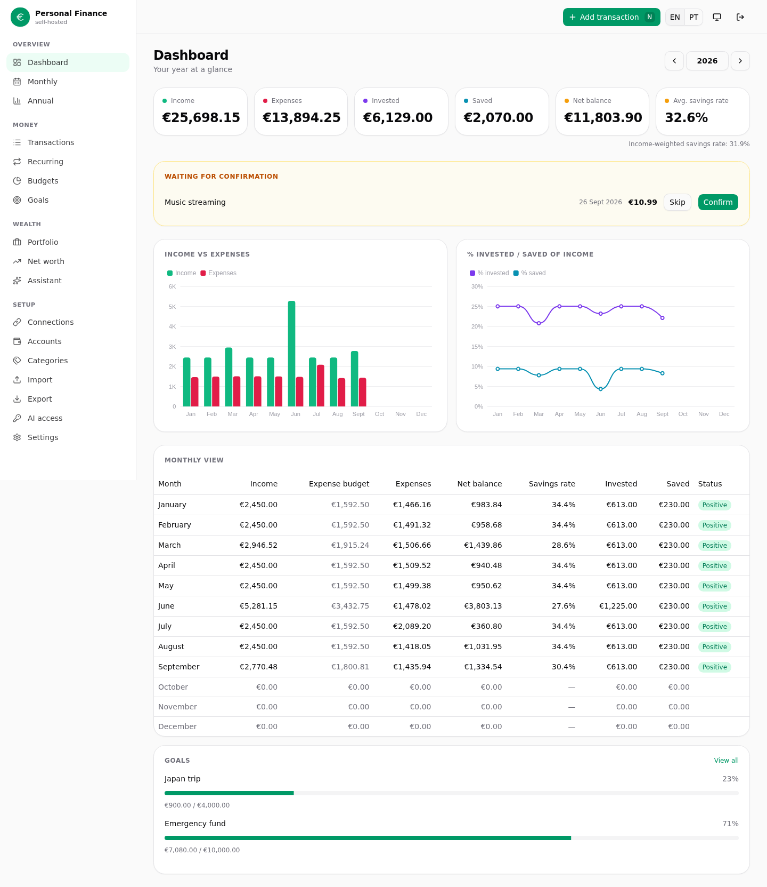
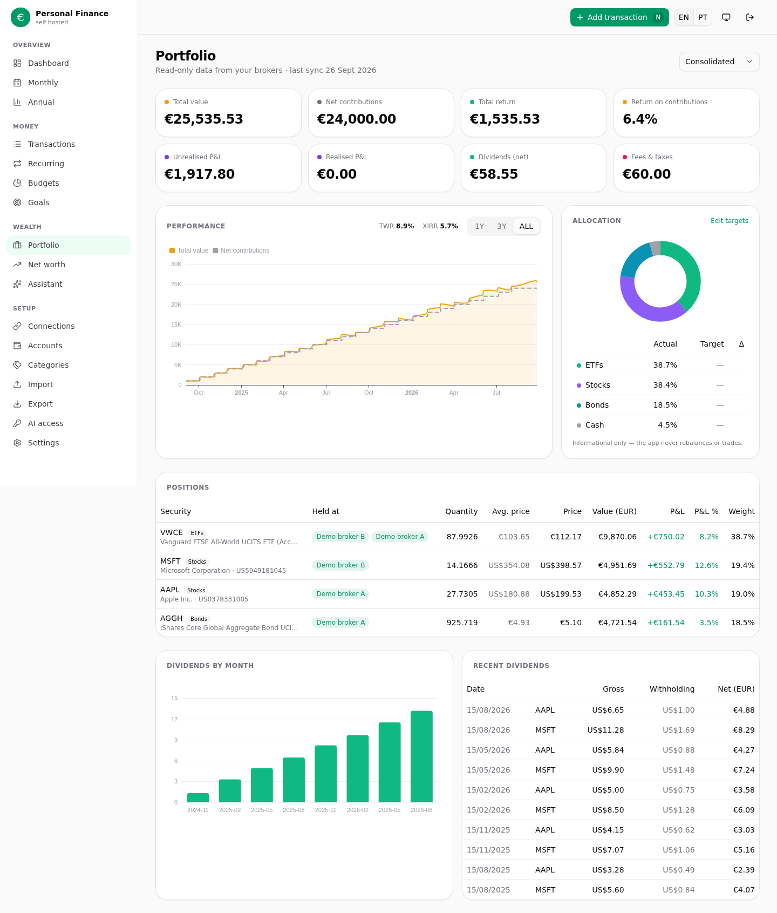
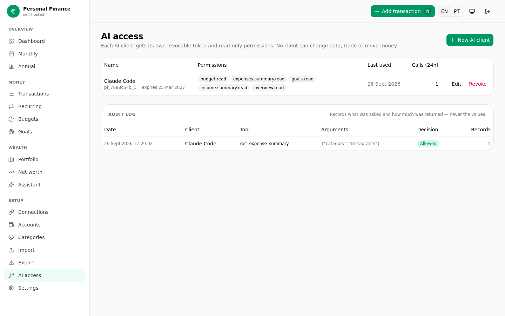
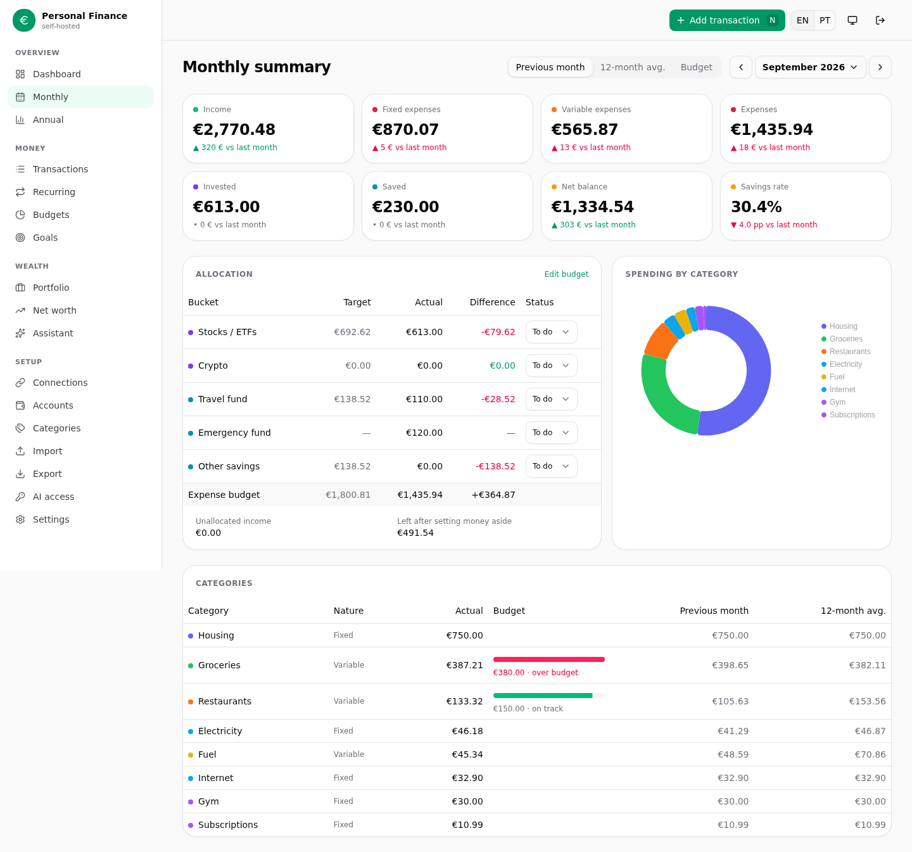
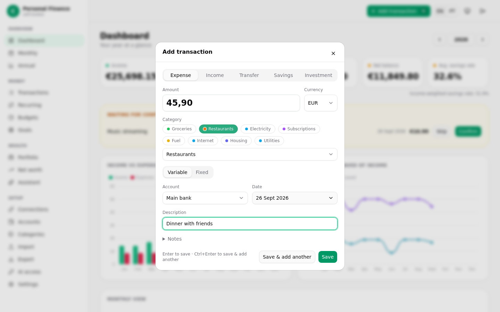
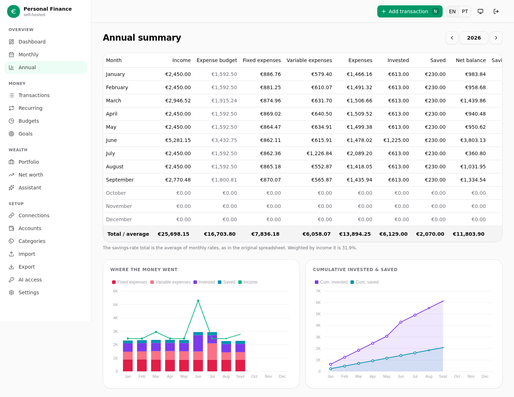
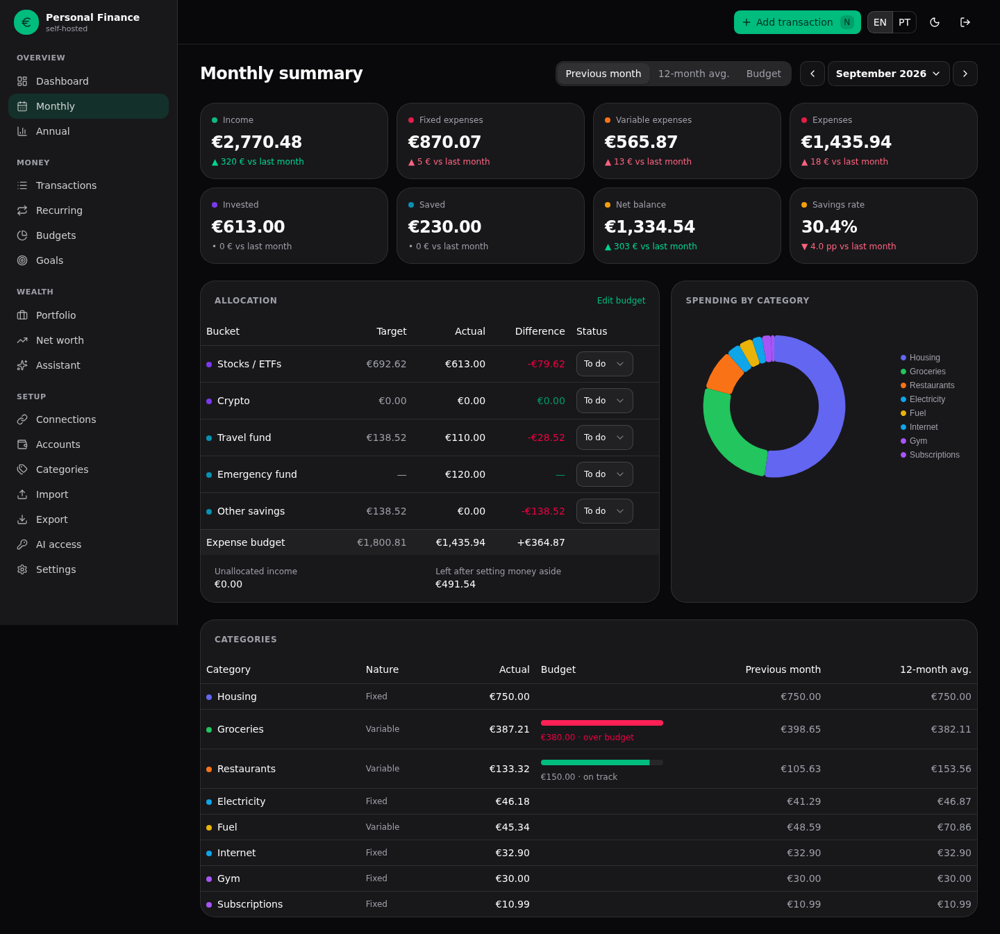
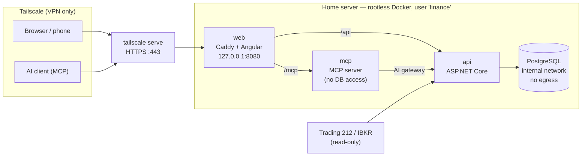

# Personal Finance

A self-hosted personal finance and investment manager that replaced my Excel workbook with a proper
application: one transaction ledger, deterministic reporting, read-only broker integrations and a
permission-gated AI interface — running on my home server, reachable only over my VPN.

[](https://github.com/joaoguimaraespro/personal-finance/actions/workflows/ci.yml)
[](https://github.com/joaoguimaraespro/personal-finance/actions/workflows/codeql.yml)




> All screenshots use fictitious demo data generated by the end-to-end test.

## Why

The workbook worked, but every month was a copy of the last sheet, every formula was duplicated twelve
times, variable spending was one cell per category, changing an allocation percentage silently rewrote
history, and investments lived in two broker apps. This project keeps the workflow I actually used —
fixed vs variable expenses, a percentage split of income into investments / savings / spending, a
monthly checklist — and rebuilds it on a database.

## Features

| Area | What it does |
|---|---|
| **Ledger** | One transaction table replaces twelve month sheets. Income, expenses (fixed/variable), transfers, savings, investment contributions. Multi-currency with original + EUR amounts. Provenance on every row (manual, recurring, Excel, CSV, broker). Soft delete and an append-only audit trail. |
| **Quick add** | Press <kbd>N</kbd> anywhere: amount first, recent categories as chips, remembered account, <kbd>Enter</kbd> to save, <kbd>Ctrl</kbd>+<kbd>Enter</kbd> to save and add another. |
| **Budgets** | Versioned by month (changing the split never rewrites past months). Percent of income, fixed EUR, or "remainder" — the spreadsheet's `1 − investments − savings`. Per-category limits (e.g. Restaurants €150). |
| **Reports** | Monthly summary vs previous month / 12-month average / budget, annual summary (every column of the old "Resumo Anual"), category breakdown, trends. All figures computed on the server with `decimal`. |
| **Recurring** | Salary, rent, subscriptions propose *expected* transactions; nothing is booked until you confirm, edit or skip. |
| **Goals** | Emergency fund, trips, house deposit — progress from linked savings, monthly amount needed. |
| **Excel migration** | Analyze → map → validate → preview → import → undo. Reconciles every month against the workbook's own totals to the cent before anything is written. Idempotent re-imports. |
| **Investments** | Read-only sync from Trading 212 (Public API + CSV) and Interactive Brokers (Flex Web Service). Consolidated portfolio by ISIN with per-broker holdings, allocation vs target, dividends with withholding tax, TWR and XIRR, net worth history. [Setup](docs/broker-integrations.md). |
| **Export** | Real .xlsx (Excel tables, native charts, schema-validated), CSV per dataset (Excel-PT dialect), complete JSON archive with restore. |
| **AI** | Read-only MCP server for Claude Code / ChatGPT / local models and an optional in-app assistant, both behind a policy gateway: per-client revocable tokens, explicit scopes, question-specific minimal answers, untrusted-text wrapping, audit. [Details](docs/ai.md). |
| **Security** | Single owner, mandatory TOTP MFA, CSRF protection, rate limiting, encrypted identifiers, least-privilege database roles, VPN-only exposure, encrypted backups. |
| **i18n** | English and European Portuguese, light/dark theme. |

<table>
<tr>
<td></td>
<td></td>
</tr>
<tr>
<td></td>
<td></td>
</tr>
<tr>
<td></td>
<td></td>
</tr>
</table>

## Architecture

A modular monolith: one deployable API, modules with their own domain, application and persistence
layers, sharing one PostgreSQL database in separate schemas.



| Module | Responsibility |
|---|---|
| `SharedKernel` | `Result`/`Error`, provenance, `YearMonth`, currency rules |
| `Finance` | Accounts, categories, buckets, transactions, recurring, budgets, goals, audit |
| `Reporting` | Monthly/annual calculators — a formula-by-formula port of the workbook, unit-tested cell by cell |
| `Imports` | Finance Tracker workbook reader, mapping, reconciliation, idempotent commit/undo |
| `Investments` | Securities, positions, trades, dividends, cash, FX (ECB), snapshots, TWR/XIRR, net worth |
| `Integrations` | `IInvestmentProvider` (reads only), sync pipeline, Trading 212, IBKR Flex, CSV, demo |
| `Exports` | XLSX with native charts, CSV, JSON archive and restore |
| `Ai` | Scopes and tool catalogue, policy gateway, audit, assistant |
| `Host.Api` | Identity + MFA, CSRF, rate limiting, health, OpenTelemetry, migrations, background jobs |
| `Host.Mcp` | MCP server — references only the AI contracts, never the database |

More in [docs/architecture.md](docs/architecture.md) and the [ADRs](docs/adr).

## Design principles

1. **The database is the source of truth.** Excel is an import/export format.
2. **The backend calculates.** Savings rate, budget variance, totals — never the UI, never an LLM.
3. **Broker integrations are read-only by construction.** No order, transfer or withdrawal operation
   exists anywhere in the codebase; an architecture test fails the build if one appears.
4. **Nothing financial happens silently.** Recurring items are proposals; imports preview and reconcile;
   every change is audited.
5. **AI is optional and least-privilege.** Scoped, revocable clients; query-specific data minimisation;
   no SQL, shell, file or write access — enforced by the gateway and by architecture tests.

## Security model (summary)

- Reachable only through Tailscale; the container publishes one port on loopback.
- ASP.NET Core Identity, single owner created with an out-of-band setup token; **TOTP MFA is mandatory**
  — a password-only session cannot reach any financial endpoint.
- `SameSite=Strict`, `HttpOnly`, `Secure` cookies; anti-forgery token on every mutating request;
  strict CSP; login rate limiting and lockout.
- Account identifiers (IBAN) encrypted at rest with ASP.NET Data Protection and masked in responses.
- PostgreSQL roles: migrator (DDL), app (DML only), backup (read only). The database has no route to
  the internet.
- Containers: non-root, read-only root filesystem, all capabilities dropped, `no-new-privileges`.
- Backups encrypted with [age](https://age-encryption.org) to a public key; the private key never lives
  on the server. Restore is drilled end to end.
- Logs and traces carry no amounts, descriptions or query strings.

Details: [docs/security.md](docs/security.md).

## Running it

### Try it on your PC (Docker only)

```powershell
git clone https://github.com/joaoguimaraespro/personal-finance.git
cd personal-finance
.\scripts\local-up.ps1          # Windows (Docker Desktop)
./scripts/local-up.sh            # macOS / Linux
```

Open **https://localhost:8443**, accept the local certificate, create the owner with the printed setup token,
enrol an authenticator app, and explore. *Connections → Demo broker* adds a fictitious portfolio.
Stop with the command the script prints (add `-v` to wipe the local database).

### Development

```bash
docker compose -f deploy/compose.dev.yml up -d          # PostgreSQL on 127.0.0.1:55432
dotnet run --project backend/src/Host.Api                  # API on http://localhost:5080 (migrates on start)
cd web && npm ci && npm start                              # UI on http://localhost:4200
```

Open the UI, create the owner with the dev setup token from `backend/src/Host.Api/appsettings.Development.json`,
enrol an authenticator app, and press <kbd>N</kbd>.

### Production (home server)

```bash
sudo deploy/scripts/server-deploy.sh --backup-recipient age1…   # idempotent; re-run to upgrade
```

One command creates an isolated `finance` user with its own rootless Docker, generates secrets, starts the
stack on loopback and publishes it on the tailnet only (`tailscale serve`, HTTPS on :8443), with daily
encrypted backups. Details in [docs/deployment.md](docs/deployment.md) and the
[disaster-recovery runbook](docs/disaster-recovery.md).

## Testing

| Suite | What it covers |
|---|---|
| `backend/tests/Reporting.Tests` | Every workbook formula reproduced with concrete numbers (e.g. `I9 = C15 − (C31 + C47)`) |
| `backend/tests/Finance.Tests` | Domain rules: amounts, currencies, transfers, recurrence schedules, budget validation |
| `backend/tests/Architecture.Tests` | Layering; no trading/money-movement operations; no raw SQL; reporting never writes |
| `backend/tests/Integration.Tests` | Real PostgreSQL via Testcontainers: auth + MFA + CSRF, CRUD + audit, reports, recurring, Excel import idempotency/undo, prompt-injection text stays inert |
| `web/e2e` | Playwright: first run → MFA enrolment → keyboard quick-add → dashboards → PT-PT → dark mode, run against the production images in CI |

```bash
cd backend && dotnet test         # backend (Docker required for integration tests)
cd web && npm test                # frontend unit tests
```

## Roadmap

- [x] Phase 0 — Workbook analysis and migration plan ([docs/excel-migration.md](docs/excel-migration.md))
- [x] Phase 1 — Finance core, Excel migration, auth
- [x] Phase 2 — Dashboards (monthly, annual, trends)
- [x] Phase 3 — Investment engine: securities, positions, dividends, TWR/XIRR, net worth
- [x] Phase 4 — Trading 212 (official Public API, read-only key) + CSV import
- [x] Phase 5 — Interactive Brokers (Flex Web Service — structurally cannot trade)
- [x] Phase 6 — XLSX / CSV / JSON export and JSON restore
- [x] Phase 7–8 — Read-only MCP server behind an AI policy gateway
- [x] Phase 9 — In-app assistant through the same gateway

## Tech

.NET 10 · ASP.NET Core minimal APIs · EF Core 10 + Npgsql · FluentValidation · ClosedXML ·
OpenTelemetry · Angular 22 (zoneless, signals) · spartan/ui (shadcn-style, Angular CDK) · Tailwind CSS 4 ·
ECharts · lucide icons · ngx-translate ·
PostgreSQL 17 · Caddy · Docker Compose · Tailscale · xUnit v3 · Testcontainers · Playwright

## License

[MIT](LICENSE)
