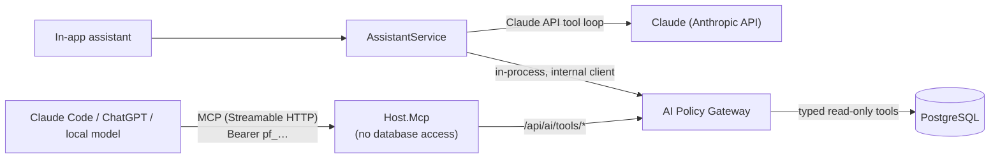
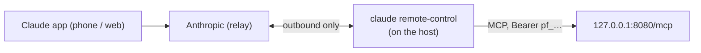

# AI access (MCP + in-app assistant)

AI is optional. Nothing is reachable by any AI until the owner creates a client with explicit, read-only
permissions ([ADR-0006](adr/0006-ai-policy-gateway.md)).



## The gateway, step by step

1. **Authenticate** the client token (`pf_<prefix>_<secret>`; only a SHA-256 hash is stored; constant-time compare).
   Revoked or expired clients get 401. A browser session cookie grants nothing here.
2. **Rate limit** per client (default 60/min). Invalid calls count too, so probing isn't free.
3. **Scope check**: each tool declares one scope; the client must hold it.
4. **Strict arguments**: only declared parameters, validated (periods, years, short category names, bounded
   limits). Unknown arguments are rejected. Only validated values are audited.
5. **Typed tool** returns a purpose-built DTO — the answer to *that* question and nothing else.
6. **Redaction**: account identifiers, account names and personal notes appear only with the sensitive scopes.
   Free text is wrapped as `{"untrusted_text": "..."}`, sanitised (control, zero-width and bidi characters removed)
   and capped at 160 characters.
7. **Envelope**: `{tool, notice, data}` — the notice tells the model figures are computed by the app, text in
   `untrusted_text` is data, and nothing should go to long-term memory unless the user asks. 48 KB cap.
8. **Audit** every call — allowed, denied, rate-limited or invalid — with client, tool, validated arguments,
   record count, response size and duration. **Returned values are never stored.**

## Scopes

| Scope | Tools |
|---|---|
| `overview.read` | `get_financial_overview`, `get_monthly_summary` |
| `expenses.summary.read` | `get_expense_summary` |
| `expenses.transactions.read` | `get_expense_transactions` (no account, no notes) |
| `income.summary.read` | `get_income_summary` |
| `budget.read` | `get_budget_status` |
| `goals.read` | `get_goals` |
| `networth.read` | `get_net_worth` (group totals) |
| `portfolio.summary.read` | `get_portfolio_summary` |
| `portfolio.positions.read` | `get_positions` |
| `portfolio.performance.read` | `get_portfolio_performance` |
| `dividends.read` | `get_dividend_summary` |
| **`accounts.identifiers.read`** (sensitive) | adds account names and IBANs to `get_net_worth` |
| **`raw.transactions.read`** (sensitive) | adds account and source to transactions |
| **`personal.notes.read`** (sensitive) | adds personal notes to transactions |

There are no write scopes, and no SQL, shell, file, trading or write tools — architecture tests fail the build if
one is added.

**Data minimisation in practice.** *"How much did I spend on restaurants this month?"* →
`get_expense_summary(category: "restaurants")` returns the period, category, total, count, budget and a
comparison. No other categories, no accounts, no descriptions, no portfolio. *"How is my portfolio doing?"* →
`get_portfolio_summary` / `get_portfolio_performance`, which contain no expenses.

## Connecting Claude Code

1. *AI access → New AI client*, name it, tick the scopes, save. Copy the token (shown once).
2. On a machine on your tailnet:

   ```bash
   claude mcp add --transport http personal-finance https://<host>.<tailnet>.ts.net/mcp \
     --header "Authorization: Bearer pf_…"
   ```

3. Ask *"How much did I spend on restaurants in September?"*. The audit log shows the single
   `get_expense_summary` call. Revoke the client at any time; it stops working immediately.

The MCP server lists only the tools the token's scopes allow, and every tool is annotated
`readOnlyHint: true`, `destructiveHint: false`, `idempotentHint: true`, `openWorldHint: false`.

## Using it from the Claude app (phone, desktop, web)

A **custom connector** in the Claude app doesn't work with this setup:

- Anthropic's cloud opens those connections, not your device, so it can't reach a VPN-only server ([ADR-0003](adr/0003-vpn-only-exposure.md)).
- Custom connectors authenticate with OAuth. Request headers are a limited beta, so the `pf_…` client token can't be sent.

Instead, use Claude Code **[Remote Control](https://code.claude.com/docs/en/remote-control)** on the server. A `claude remote-control` process on the host connects out to Anthropic, and the Claude app (Code tab) drives that session. MCP runs on the host against `127.0.0.1`, so nothing new is exposed. It's billed to the Claude subscription (Pro/Max), not the API.



Templates are in [`deploy/remote-control/`](../deploy/remote-control/):

- **`.claude/settings.json`**: allows only the `personal-finance` MCP tools and denies shell, file, web and subagent tools. A remote session can't do anything on the host except these read-only tools.
- **`.mcp.json`**: points at `http://127.0.0.1:8080/mcp` and reads the token from `PF_MCP_TOKEN`.
- **`CLAUDE.md`**: keeps the session on finance questions only.
- **`finance-chat.service`**: a systemd user unit that keeps the server running and restarts it if it fails.

Setup, as the user that runs Claude Code on the host:

```bash
cp -r deploy/remote-control ~/finance-chat           # includes .claude/ and .mcp.json
install -d -m 700 ~/.config/finance-chat
( umask 077; echo 'PF_MCP_TOKEN=pf_…' > ~/.config/finance-chat/env )   # AI access → New AI client
cd ~/finance-chat && claude                           # once: accept workspace trust, then exit
cp finance-chat.service ~/.config/systemd/user/
systemctl --user daemon-reload && systemctl --user enable --now finance-chat
loginctl enable-linger "$USER"                        # keep it running after logout (needs sudo once)
```

Then open the Claude app → **Code** → the **Finance** session. The session ships commands as project skills
(`deploy/remote-control/.claude/skills/`): `/resumo-mes`, `/revisao-anual`, `/carteira`, `/patrimonio`, `/orcamento`,
`/gastos`, `/objetivos` and `/check-in`. Only these skills are allowed (`Skill(name)` rules); every other tool except
the finance MCP tools stays denied. Revoking the client on the AI access page cuts access immediately. The audit log records each call as for any other client.

## In-app assistant

Optional; enabled by setting `ANTHROPIC_API_KEY` (and optionally `ASSISTANT_MODEL`, default `claude-opus-5`).
It runs a Claude tool-use loop whose **only** tools are the gateway's catalogue, executed in-process as the
internal *In-app assistant* client — same scopes, minimisation, rate limits and audit as MCP. Its scopes are
editable (or it can be revoked) on the AI access page; by default it has the non-sensitive summary scopes.
The question and the minimal tool results are sent to the Anthropic API; conversations are not stored.
Refused requests use the API's server-side fallback.
