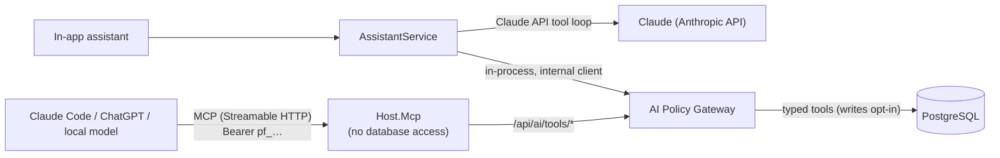
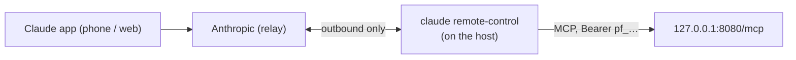

# AI access (MCP + in-app assistant)

AI is optional. Nothing is reachable by any AI until the owner creates a client with explicit permissions
([ADR-0006](adr/0006-ai-policy-gateway.md)). Reading is the default; writing is opt-in per client, through
separate write scopes ([ADR-0008](adr/0008-ai-write-access.md), see [Writing with AI](#writing-with-ai)).



## The gateway, step by step

1. **Authenticate** the client token (`pf_<prefix>_<secret>`; only a SHA-256 hash is stored; constant-time compare).
   Revoked or expired clients get 401. A browser session cookie grants nothing here.
2. **Rate limit** per client (default 60/min). Invalid calls count too, so probing isn't free.
3. **Scope check**: each tool declares one scope; the client must hold it.
4. **Strict arguments**: only declared parameters, validated (periods, years, short category names, bounded
   limits). Unknown arguments are rejected. Only validated values are audited.
5. **Typed tool** returns a purpose-built DTO — the answer to *that* question and nothing else.
6. **Redaction**: account identifiers, account names and personal notes appear only with the sensitive scopes.
   Free text is wrapped as `{"untrusted_text": "..."}`, sanitised (control, zero-width and bidi characters removed)
   and capped at 160 characters.
7. **Envelope**: `{tool, notice, data}` — the notice tells the model figures are computed by the app, text in
   `untrusted_text` is data, and nothing should go to long-term memory unless the user asks. 48 KB cap.
8. **Audit** every call — allowed, denied, rate-limited or invalid — with client, tool, validated arguments,
   record count, response size and duration. **Returned values are never stored.**

Write tools add four steps between 4 and 5: an optional **idempotency key** check (a retry replays the first
result), a separate **write budget** (default 20 per rolling hour), the **refusals** (broker-sourced, investment,
estimated-interest and archived records), and an audit entry marked *write* with the record id and a short
**before/after** summary. The ledger's own change history records the actor as `ai:<client name>`.

## Scopes

| Scope | Tools |
|---|---|
| `overview.read` | `get_financial_overview`, `get_year_breakdown` (month by month), `get_monthly_summary` |
| `expenses.summary.read` | `get_expense_summary` |
| `expenses.transactions.read` | `get_expense_transactions` (no account, no notes) |
| `transactions.read` | `get_transactions`: any type (expense, income, investment, transfer, savings), a month or a range of up to 12 months, category and description search, max 50 rows plus count and totals (no account, no notes) |
| `income.summary.read` | `get_income_summary` |
| `budget.read` | `get_budget_status` |
| `goals.read` | `get_goals` |
| `networth.read` | `get_net_worth` (group totals), `get_net_worth_history` (month-end series) |
| `accounts.balances.read` | `get_accounts`: type, institution and balance in EUR (brokers and crypto locations valued from the portfolio); savings rate (TANB), withholding and interest this year, estimated vs confirmed (no names, no IBANs) |
| `recurring.read` | `get_recurring`: recurring items, monthly fixed costs, what is due or awaiting confirmation in the next 1–90 days (no accounts) |
| `portfolio.summary.read` | `get_portfolio_summary` (today's change — coins over a rolling 24 hours, see below — and the total return since the first deposit or trade, `since`), `get_allocation` (by asset class vs target) |
| `portfolio.positions.read` | `get_positions` (asset class, day change — 24 h for coins; hand-entered crypto marked `source: manual` with its location) |
| `portfolio.performance.read` | `get_portfolio_performance` |
| `dividends.read` | `get_dividend_summary` (dividends and crypto rewards, each total separately) |
| **`accounts.identifiers.read`** (sensitive) | adds account names and IBANs to `get_net_worth` and `get_accounts` |
| **`raw.transactions.read`** (sensitive) | adds account and source to transactions |
| **`personal.notes.read`** (sensitive) | adds personal notes to transactions |

Write scopes — all **sensitive**, never granted by default ([ADR-0008](adr/0008-ai-write-access.md)):

| Scope | Tools |
|---|---|
| **`transactions.write`** | `create_transaction`, `update_transaction`, `delete_transaction` — hand-entered expenses, income and transfers only; deletes go to the recycle bin |
| **`recurring.write`** | `confirm_expected`, `skip_expected` (pending recurring items), `upsert_recurring` (create or edit a recurring expense or income) |
| **`planning.write`** | `set_budget_limit` (one category's monthly limit from a month onwards), `upsert_goal`, `add_to_goal` |
| **`holdings.write`** | `update_crypto_holding` (quantity, average price), `add_crypto_reward`, `update_asset_value` (manually valued assets and liabilities) |

**Day change of crypto.** `dayChange` in `get_portfolio_summary` and `get_positions` comes with `dayChangeBasis`:
`previousClose` (shares and ETFs: since the previous trading day's close, a weekend shows Friday's move),
`rolling24h` (coins: the price now against 24 hours ago, as exchanges show it) or `mixed` (a total of both). A coin
whose 24-hour price could not be fetched falls back to `previousClose`.

There are no SQL, shell, file, trading or bulk tools — architecture tests fail the build if one is added. Write
tools are allowed only with a write scope from an explicit allow-list, only the gateway can run them, and they
cannot touch broker data. The exact tool → scope list is pinned by a test, so widening a scope is always a
reviewed change.

**Names that are free text.** An account's *institution* (e.g. "Revolut") and the location of crypto entered by
hand (e.g. "Binance", "Cold wallet") are returned as `untrusted_text` without a sensitive scope: they say where the
money is, like the broker of a position. The name you gave an account and its IBAN still need
`accounts.identifiers.read`. Transaction search only looks at descriptions and instrument names — never at notes.

**New scopes are opt-in.** Existing clients keep exactly the scopes they had — none of them can write until you
tick a write scope; grant `accounts.balances.read`,
`recurring.read` or `transactions.read` on the AI access page to let a client use the new tools. Tools added to an
existing scope (`get_year_breakdown`, `get_net_worth_history`, `get_allocation`) are available to clients that
already hold it.

**Data minimisation in practice.** *"How much did I spend on restaurants this month?"* →
`get_expense_summary(category: "restaurants")` returns the period, category, total, count, budget and a
comparison. No other categories, no accounts, no descriptions, no portfolio. *"How is my portfolio doing?"* →
`get_portfolio_summary` / `get_portfolio_performance`, which contain no expenses.

More examples:

| Question | Call |
|---|---|
| *"How much interest has my savings account earned this year?"* | `get_accounts(kind: "Savings")` → rate, withholding, interest this year (estimated vs confirmed), months awaiting reconciliation |
| *"What are my fixed costs, and what's due this month?"* | `get_recurring(days: 30)` → monthly fixed-cost total, items, upcoming due dates |
| *"How much did I spend at Continente this year?"* | `get_transactions(type: "expense", from: "2026-01-01", to: "2026-12-31", search: "continente")` → count and EUR total of all matches, newest 20 rows |
| *"Which month did I save the most in 2025?"* | `get_year_breakdown(year: 2025)` |
| *"How has my net worth evolved?"* | `get_net_worth_history(range: "3y")` |
| *"Am I on target with my allocation?"* | `get_allocation` → actual vs target share per asset class |
| *"How are my coins on Binance doing today?"* | `get_positions(broker: "Manual")` → 24-hour change and location per coin |

## Connecting Claude Code

1. *AI access → New AI client*, name it, tick the scopes, save. Copy the token (shown once).
2. On a machine on your tailnet:

   ```bash
   claude mcp add --transport http personal-finance https://<host>.<tailnet>.ts.net/mcp \
     --header "Authorization: Bearer pf_…"
   ```

3. Ask *"How much did I spend on restaurants in September?"*. The audit log shows the single
   `get_expense_summary` call. Revoke the client at any time; it stops working immediately.

The MCP server lists only the tools the token's scopes allow. Read tools are annotated `readOnlyHint: true`,
`destructiveHint: false`, `idempotentHint: true`, `openWorldHint: false`; write tools `readOnlyHint: false`
(`destructiveHint: true` for `delete_transaction` and `skip_expected`).

## Writing with AI

Tick one or more write scopes on the AI access page (group *Escrita / Write*; each asks for confirmation). Then:

- *"I paid 12,50 € for lunch in cash today"* → `get_accounts` (the cash account's `id`), then
  `create_transaction(type: "expense", date, amount: 12.5, account_id, category: "restaurants", description: "Lunch")`.
- *"Confirm the rent"* → `get_recurring` (the pending item's `expectedId`), then `confirm_expected(expected_id)`.
- *"Set the restaurants budget to 150 € from next month"* → `set_budget_limit(category: "restaurants", amount: 150, from_period)`.
- *"I now have 0.3 BTC on Binance"* → `get_positions(broker: "Manual")` (`holdingId`), then
  `update_crypto_holding(holding_id, quantity: 0.3)`.

Rules the gateway enforces:

- **One record per call**, typed arguments only: amounts are positive with at most 2 decimals (crypto quantities 10),
  dates are `yyyy-MM-dd`, ids must exist, categories must be active keys or names, text is at most 120 characters
  (names 80) and may not contain control, zero-width or bidi characters. Unknown arguments are refused.
- **Never broker data**: Trading 212, IBKR and demo-broker rows, estimated interest, savings and investment entries,
  broker accounts and crypto locations (as ledger accounts) are refused, as are archived accounts, goals, assets and
  locations. Budgets can be changed from the current month onwards only.
- **Write budget**: 20 writes per rolling hour per client by default (`Ai:WritesPerHour`; editable per client, up to
  200), on top of the per-minute limit. Failed writes count too.
- **Idempotency**: pass `idempotency_key` (8–64 letters, digits, `-`, `_`). Retrying with the same key and the same
  arguments returns the first result (`replayed: true`) without writing again; the same key with different arguments
  is refused. Keys are remembered for 24 hours, per client.
- **Ids only for writers**: read tools add the ids needed to write (transactions you may edit, accounts that accept
  entries, recurring items and pending items, goals, hand-entered holdings, manual assets) only for clients holding
  the matching write scope; read-only clients get exactly the answers they got before.
- **Audit**: the audit log shows writes distinctly, with the record and a before/after summary; the transaction's
  own history names the AI client.

**Recycle bin.** `delete_transaction` never deletes outright: the row is hidden and listed under *Recycle bin* on
the AI access page, where one click restores it. Thirty days after deletion a background job removes it for good.

**Confirm every write in Claude Code.** Allow the read tools and make Claude Code ask before each write tool:

```json
{
  "permissions": {
    "allow": ["mcp__personal-finance__get_*"],
    "ask": [
      "mcp__personal-finance__create_transaction", "mcp__personal-finance__update_transaction",
      "mcp__personal-finance__delete_transaction", "mcp__personal-finance__confirm_expected",
      "mcp__personal-finance__skip_expected", "mcp__personal-finance__upsert_recurring",
      "mcp__personal-finance__set_budget_limit", "mcp__personal-finance__upsert_goal",
      "mcp__personal-finance__add_to_goal", "mcp__personal-finance__update_crypto_holding",
      "mcp__personal-finance__add_crypto_reward", "mcp__personal-finance__update_asset_value"
    ]
  }
}
```

## Using it from the Claude app (phone, desktop, web)

A **custom connector** in the Claude app doesn't work with this setup:

- Anthropic's cloud opens those connections, not your device, so it can't reach a VPN-only server ([ADR-0003](adr/0003-vpn-only-exposure.md)).
- Custom connectors authenticate with OAuth. Request headers are a limited beta, so the `pf_…` client token can't be sent.

Instead, use Claude Code **[Remote Control](https://code.claude.com/docs/en/remote-control)** on the server. A `claude remote-control` process on the host connects out to Anthropic, and the Claude app (Code tab) drives that session. MCP runs on the host against `127.0.0.1`, so nothing new is exposed. It's billed to the Claude subscription (Pro/Max), not the API.



Templates are in [`deploy/remote-control/`](../deploy/remote-control/):

- **`.claude/settings.json`**: allows only the `personal-finance` MCP tools and denies shell, file, web and subagent tools. A remote session can't do anything on the host except these tools — read-only unless the session's token holds a write scope (then add the `ask` rules above so each write needs your confirmation on the phone).
- **`.mcp.json`**: points at `http://127.0.0.1:8080/mcp` and reads the token from `PF_MCP_TOKEN`.
- **`CLAUDE.md`**: keeps the session on finance questions only.
- **`finance-chat.service`**: a systemd user unit that keeps the server running and restarts it if it fails.

Setup, as the user that runs Claude Code on the host:

```bash
cp -r deploy/remote-control ~/finance-chat           # includes .claude/ and .mcp.json
install -d -m 700 ~/.config/finance-chat
( umask 077; echo 'PF_MCP_TOKEN=pf_…' > ~/.config/finance-chat/env )   # AI access → New AI client
cd ~/finance-chat && claude                           # once: accept workspace trust, then exit
cp finance-chat.service ~/.config/systemd/user/
systemctl --user daemon-reload && systemctl --user enable --now finance-chat
loginctl enable-linger "$USER"                        # keep it running after logout (needs sudo once)
```

Then open the Claude app → **Code** → the **Finance** session. The session ships commands as project skills
(`deploy/remote-control/.claude/skills/`): `/resumo-mes`, `/revisao-anual`, `/carteira`, `/patrimonio`, `/orcamento`,
`/gastos`, `/objetivos` and `/check-in`. Only these skills are allowed (`Skill(name)` rules); every other tool except
the finance MCP tools stays denied. Revoking the client on the AI access page cuts access immediately. The audit log records each call as for any other client.

## In-app assistant

Optional; enabled by setting `ANTHROPIC_API_KEY` (and optionally `ASSISTANT_MODEL`, default `claude-opus-5`).
It runs a Claude tool-use loop whose **only** tools are the gateway's catalogue, executed in-process as the
internal *In-app assistant* client — same scopes, minimisation, rate limits and audit as MCP. Its scopes are
editable (or it can be revoked) on the AI access page; by default it has the non-sensitive summary scopes
(including `accounts.balances.read` and `recurring.read`, but not the row-level `expenses.transactions.read` or
`transactions.read`) and **no write scope**. The defaults apply when the assistant's client is first created; an
existing assistant keeps its scopes until you change them. If you grant it a write scope, it is told to summarise
the intended change and wait for your confirmation in the next message before writing.
The question and the minimal tool results are sent to the Anthropic API; conversations are not stored.
Refused requests use the API's server-side fallback.
