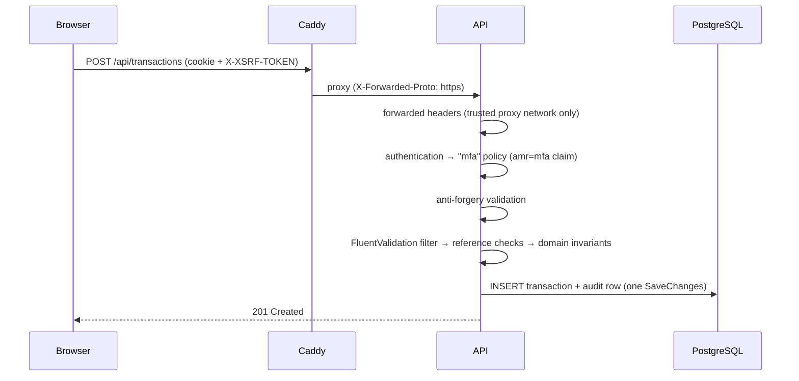

# Architecture

## Shape

A **modular monolith** (see [ADR-0001](adr/0001-modular-monolith.md)). One API process, one database,
module boundaries enforced by project references and architecture tests rather than by the network.

```
backend/                             .NET solution: PersonalFinance.slnx, global.json, central package versions
  src/
    SharedKernel/                    Result/Error, DataSource (provenance), YearMonth, Currency, Entity
    Modules/
      Finance/
        Finance.Domain/              Entities + invariants. No EF, no ASP.NET.
        Finance.Application/         Feature slices: request DTOs, validators, endpoints, queries
        Finance.Infrastructure/      EF Core DbContext (schema "finance"), audit interceptor, seeding
      Reporting/Reporting.Application/  Pure calculators + read-only queries
      Imports/Imports.Application/      Workbook reader, planner, reconciliation, commit/undo
    Host.Api/                        Composition root: Identity/MFA, CSRF, rate limits, health, OTel
  tests/                             Unit, architecture and Testcontainers integration tests
web/                                 Angular SPA; spartan/ui components in src/app/ui (ADR-0007)
deploy/                              Compose, Caddy, Postgres roles, backup/restore
```

### Dependency rules (tested in `backend/tests/Architecture.Tests`)

- `Finance.Domain` depends only on `SharedKernel`.
- Application layers never reference Npgsql, infrastructure projects or the host.
- `Reporting` never calls `SaveChanges` — reports cannot mutate data.
- No method anywhere may be named like a trading or money-movement operation
  (`PlaceOrder`, `Buy`, `Sell`, `Withdraw`, `Deposit`, …).
- No raw SQL APIs (`FromSqlRaw`, `ExecuteSqlRaw`, …) in application code.

## The ledger

The spreadsheet had twelve identical month sheets. The application has one `transactions` table:

| Column | Notes |
|---|---|
| `type` | `Expense`, `Income`, `Transfer`, `Savings`, `InvestmentContribution` — amounts are always positive, direction comes from the type |
| `occurred_on`, `occurred_at_utc`, `time_zone` | Local date for reporting; optional UTC instant; default zone `Europe/Lisbon` |
| `account_id`, `counter_account_id` | Counter account for transfers, savings and contributions |
| `category_id`, `nature` | Fixed/variable defaults from the category but can be overridden per row (the workbook allowed "Outro" in both blocks) |
| `bucket_id`, `goal_id` | Allocation bucket (Stocks/ETFs, Crypto, Travel, …) and optional goal |
| `original_amount`, `original_currency`, `fx_rate`, `base_amount`, `base_currency` | `numeric(19,4)` money, `numeric(19,10)` rates; `decimal` in C# |
| `source`, `import_id`, `external_id` | Provenance; `(source, external_id)` is unique so re-imports and re-syncs cannot duplicate |
| `deleted_at_utc` | Soft delete (global query filter) |

Every insert, update, delete and restore writes a row to `transaction_audit` from an EF Core
`SaveChangesInterceptor`, so there is no code path that changes money without a trace.

## Calculations

`Reporting.Application.Calculations` is a direct port of the workbook, with the original cell references
in comments and a unit test per formula:

| Workbook | Application |
|---|---|
| `I12 = B7 − (C31 + C47)` — net balance (investments are *not* subtracted) | `MonthlySummary.NetBalance` |
| `I13 = (D11+D12+D13+D14) / B7` — savings rate counts investments as saving | `MonthlySummary.SavingsRate` |
| `C15 = B7 × (1 − B7_inv − B11_sav)` | Budget item with mode `Remainder` |
| `J16 = AVERAGEIF(J4:J15,"<>")` — **unweighted** mean of monthly rates | `AverageMonthlySavingsRate` (kept for parity) + `WeightedSavingsRate` |
| `L/M` cumulative invested/saved | `AnnualRow.CumulativeInvested/Saved` |
| `NA()` when income is 0 | `null`, rendered as "—" |

Additions the workbook lacked: `FreeCashFlow` (income − expenses − invested − saved), budget versions per
month, per-category limits, comparisons against the previous month and a 12-month average.

## Interest on savings accounts

Savings and bank accounts can carry a nominal annual rate (TANB) with a withholding percentage (default 28 %,
the Portuguese *taxa liberatória*). Rates live in `account_interest_rates` as append-only periods: a change adds a
period from its effective date, only the latest one can be removed (typo fix).

- **Accrual** (`Finance.Domain.Interest.InterestAccrual`, pure): every calendar day, weekends included,
  `max(end-of-day balance, 0) × TANB / 365 × (1 − withholding)`. The divisor is 365 in leap years too. Accrual
  starts at the later of the opening-balance date and the first rate period and stops the day before an account is
  archived. Monthly payout credits the rounded month at month end; daily payout compounds daily.
- **Estimates in the ledger** (`InterestAccrualService`): one `Income` row per account-month, category `interest`,
  `source = InterestEstimate`, `external_id = interest:{account}:{yyyy-MM}`. Because it is an ordinary row, balances,
  net worth and reports include it. It is recalculated after every ledger change on the account and hourly by
  `InterestAccrualJob`, and cannot be edited or deleted by hand.
- **Reconciliation** (`interest_months`): after a month closes the user confirms the estimate or enters the real
  amount; the estimate row is removed and a real `Manual` row is booked in the same save. A month never carries an
  estimate once it is reconciled or real interest for it is already in the ledger, so interest is never counted
  twice. Unanswered months stay estimated.
- Foreign-currency accounts book estimates with the latest known EUR rate for that currency; with none, no estimate
  is booked until one exists.

## Request flow



## Frontend

Angular 22 standalone components, zoneless change detection, signals and `rxResource` for data.
A `DataEvents.version` signal is bumped after every mutation so every visible view re-fetches the
server-calculated figures — the UI never derives financial numbers itself. Translations are loaded at
runtime (`/i18n/en.json`, `/i18n/pt-PT.json`); built-in categories are translated by key.

## Observability

OpenTelemetry traces, metrics and logs are exported only when `OTEL_EXPORTER_OTLP_ENDPOINT` is set.
Health endpoints are filtered out, query strings are stripped from spans, and log messages use templates
without amounts or descriptions.
