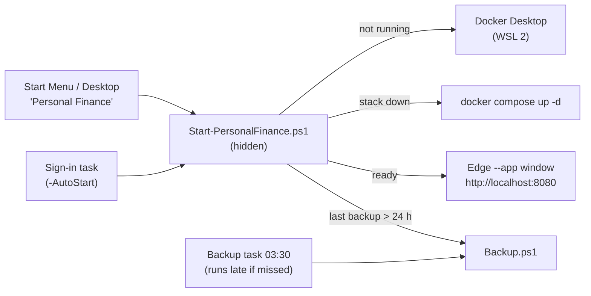

# Windows PC

Run Personal Finance on a Windows PC that is **not on 24 hours a day**: it starts when you sign in (optional), when you
open it from the Start Menu like any other app, or is simply there if it is already running. It uses the same images
and the same `deploy/compose.yml` as the [Linux server](deployment.md), on Docker Desktop, plus a small override
([`deploy/compose.windows.yml`](../deploy/compose.windows.yml)). Everything listens on `127.0.0.1` only.



## Requirements

| | |
|---|---|
| Windows | 10 22H2 or 11, 64-bit, virtualization enabled in the firmware |
| Memory / disk | 8 GB RAM (the stack is capped at about 2.2 GB), about 10 GB free |
| [Docker Desktop](https://www.docker.com/products/docker-desktop/) | WSL 2 backend, Linux containers (the defaults). Installing it is the only step that needs administrator rights. Free for personal use under Docker's subscription terms. |
| Git | to download and update the code |
| [age](https://age-encryption.org) | only for backups |
| [rclone](https://rclone.org) | only for the optional off-site copy |

```powershell
# Administrator PowerShell, once (restart Windows if WSL was just installed):
wsl --install
winget install --id Docker.DockerDesktop -e
# Normal PowerShell:
winget install --id Git.Git -e
winget install --id FiloSottile.age -e       # backups
winget install --id Rclone.Rclone -e         # optional off-site copy
```

Start Docker Desktop once and accept its terms. winget checks every download against the SHA-256 pinned in its
manifest. If you download `age.exe` by hand instead, take it from the
[official release page](https://github.com/FiloSottile/age/releases), compare `Get-FileHash age.exe` with the checksum
published for that release, and put it in `<install folder>\tools\age\age.exe` (or anywhere on `PATH`).

## Install

```powershell
git clone https://github.com/joaoguimaraespro/personal-finance.git "$env:LOCALAPPDATA\PersonalFinance"
powershell -ExecutionPolicy Bypass -File "$env:LOCALAPPDATA\PersonalFinance\deploy\windows\Install.ps1" -AutoStart -BackupRecipient age1...
```

Works the same from PowerShell 7 (`pwsh`) or the Windows PowerShell 5.1 that comes with Windows. `-ExecutionPolicy
Bypass` applies to this one command only; the shortcuts and tasks pass it themselves, so you never have to change the
machine's policy.

[`Install.ps1`](../deploy/windows/Install.ps1) is idempotent and:

1. checks Git, Docker Desktop (Linux containers) and WSL 2, with the command to fix whatever is missing;
2. clones the repository into `-InstallDir` (default `%LOCALAPPDATA%\PersonalFinance`) or fast-forwards it;
3. generates `deploy\.env` once, with crypto-random secrets (like `server-deploy.sh`), and restricts it to your user
   with `icacls` (inheritance removed, only you have access);
4. starts Docker Desktop if needed, builds the images and starts the stack (`up -d --build --wait`; the first build
   takes several minutes), then waits until the app answers;
5. creates **Personal Finance** shortcuts in the Start Menu and on the Desktop, with the app icon;
6. `-AutoStart`: registers the sign-in task (below);
7. `-BackupRecipient age1…`: stores the backup public key and registers the daily backup task;
8. prints the one-time **setup token** while no owner exists, and opens the app.

| Option | Default | |
|---|---|---|
| `-InstallDir` | `%LOCALAPPDATA%\PersonalFinance` | Code, `deploy\.env`, `backups\`, `logs\` |
| `-Port` | `8080` | Only when `.env` is created; later edit `HTTP_PORT` in `deploy\.env` |
| `-AutoStart` / `-DisableAutoStart` | unchanged | Bring the app up quietly at sign-in |
| `-BackupRecipient` | none | age public key (`age1…`), never the private key |
| `-Ref` | `main` | Branch or tag to install |
| `-NoShortcuts`, `-NoOpen` | | |

Run it in your own terminal, since it prints the setup token. Then create the owner, enrol an authenticator app and
store the recovery codes, exactly as on the server. MFA is mandatory here too.

## Daily use

Open **Personal Finance** from the Start Menu, the Desktop or the taskbar (right-click the window → *Pin to taskbar*).
The shortcut runs [`Start-PersonalFinance.ps1`](../deploy/windows/Start-PersonalFinance.ps1) without a console window:

| State | What happens |
|---|---|
| Everything running | The window opens immediately |
| Containers stopped | `docker compose up -d`, wait until the app answers, open |
| Docker Desktop not running | Start Docker Desktop, wait for it (up to 5 min), then as above |
| Docker Desktop not installed / failing | A message box says what is wrong; details in `logs\launcher.log` |

While a slow start is in progress a notification and a tray icon say so. The app opens in its own window: Microsoft
Edge `--app` (Chrome `--app` if Edge is missing, otherwise the default browser), with a **dedicated browser profile**
(`browser-profile\`), so extensions from your everyday browsing cannot read the pages.

**Auto-start** (`-AutoStart`): a Scheduled Task runs the launcher with `-Background` 30 seconds after you sign in. It
starts Docker Desktop if needed and brings the containers up without opening a window, so the app is ready when you
click the shortcut and broker syncs and snapshots run even if you never open it that day. No change to Docker Desktop's
own settings is needed (enable *Start Docker Desktop when you sign in* there too if you like; both are harmless). If
Task Scheduler is blocked by policy, the installer puts a shortcut in your Startup folder instead.

Closing the window leaves the stack running (Docker Desktop's VM uses about 1–1.5 GB of RAM). To stop it:
`docker compose -p personal-finance stop`, or quit Docker Desktop. Sleep and hibernation are fine: containers resume
with the VM. Without `-AutoStart`, the containers still come back on their own whenever Docker Desktop starts
(`restart: unless-stopped`).

## When the PC was off

The server runs around the clock; a PC does not. The background jobs are written for that: they decide what is due
from the **wall clock and the database**, not from timers that stop while the PC sleeps, so they catch up within
minutes of the app starting (or of the PC waking up), and every job is idempotent, so catching up never duplicates
anything.

| Job | After days off |
|---|---|
| Broker sync | First check 1 minute after start, then every 5 minutes. Due when the last success is too old (Trading 212: 4 h; IBKR: once per UTC day, after 06:00 UTC when the day's statement exists). Only attempts from the last 2 days count for the failure back-off, so an old failure never delays the catch-up. |
| Recurring items | Checked at start, hourly and on each new day. Every occurrence that fell due while the PC was off becomes a pending proposal (never twice), and shows as overdue on the dashboard and to AI clients until you confirm or skip it. |
| Interest accrual | 1 minute after start, hourly and on each new day. Recalculated from daily balances up to today, so the days off are included. |
| Portfolio and net-worth snapshots | 1 minute after start, every 6 hours and at the start of each UTC day. One snapshot per day the app runs. |
| Reconstructed history (Trading 212) | Rebuilt after each sync and with each snapshot run, as on the server. |
| AI recycle bin purge | At start and every 6 hours. |
| Backups | See below: missed runs start as soon as the PC is on. |

**Charts across days off.** Days on which the app did not run get no computed snapshot of their own: the value chart
draws a straight line from the last value before the gap to the first one after it. Returns stay correct: deposits
and withdrawals are taken from the ledger and attributed to the interval between two values, so money added while
the PC was off is never counted as a gain. IBKR accounts fill the gap with the broker's own daily NAV, as far back as
the Flex query's period reaches ([broker-integrations.md](broker-integrations.md)). Net worth is charted the same way
(one point per day the app ran).

## Update

```powershell
powershell -ExecutionPolicy Bypass -File "$env:LOCALAPPDATA\PersonalFinance\deploy\windows\Update.ps1"
```

Takes an encrypted backup first (when configured; `-SkipBackup` to skip), then runs `Install.ps1`: `git pull`,
rebuild, restart. Settings, data, shortcuts and tasks are kept; schema migrations run before the API starts. Re-running
`Install.ps1` does the same without the backup.

## Backups and restore

**Key.** Create the age key pair and keep the private key **off this PC** (password manager or USB). On another
machine, or here and then move the identity file away:

```powershell
age-keygen -o finance-backup-identity.txt     # private key: store offline, then delete it from this PC
age-keygen -y finance-backup-identity.txt     # public key: age1...
```

**Enable.** `Install.ps1 -BackupRecipient age1...` (or re-run it later with the option). This registers the
*PersonalFinance Backup* task: daily at 03:30 with **"run as soon as possible after a missed start"**, so a PC that was
off at 03:30 backs up shortly after you sign in. On top of that, whenever the launcher runs and the newest backup is
older than 24 hours, it starts one in the background. Only one backup runs at a time.

[`Backup.ps1`](../deploy/windows/Backup.ps1) is the PowerShell port of `backup.sh`: `pg_dump` with the read-only backup
role and the Data Protection key ring, checksummed in a manifest, encrypted with `age` to
`backups\finance-<UTC timestamp>.tar.age`. Archives older than `BACKUP_RETENTION_DAYS` (35) are deleted, but never the
newest, so a PC left off for months still has its last backup. Run it by hand any time; logs are in `logs\backup.log`.

**Off-site copy** (optional, recommended: a laptop's disk can die or be stolen with its backups). Configure an rclone
remote as for the server ([deployment.md](deployment.md#off-site-copy): a bucket key that cannot delete, plus a
lifecycle rule), then set `BACKUP_REMOTE` in `deploy\.env`:

```powershell
rclone config create b2 b2 account <keyID> key <applicationKey>
# deploy\.env:  BACKUP_REMOTE=b2:pf-backups-<random>/finance
& "$env:LOCALAPPDATA\PersonalFinance\deploy\windows\Backup.ps1"     # prints "Off-site copy up to date"
```

**Restore** (DESTRUCTIVE, replaces all data): bring the identity file in temporarily, then

```powershell
cd "$env:LOCALAPPDATA\PersonalFinance\deploy\windows"
.\Restore.ps1 -Archive ..\..\backups\finance-20261005T033000Z.tar.age -Identity E:\finance-backup-identity.txt
```

It decrypts, verifies the checksums, asks you to type `restore`, stops the app, restores the database as the schema
owner, re-applies the least-privilege grants, restores the key ring and restarts. Remove the identity file afterwards.

**Moving between Linux and Windows.** Archives have the same layout on both platforms (`finance.dump`, `dp-keys.tar`,
`manifest.txt`), so `Restore.ps1` restores a server backup and `restore.sh` restores a Windows one. Install on the
target first (fresh secrets are fine: database passwords live in each machine's `.env`, not in the dump), copy the
latest `.tar.age` across (or `rclone copy` it from the off-site bucket), and restore it with the identity file. The key
ring travels in the archive, so encrypted account identifiers stay readable.

## Phone access (optional)

Off by default: nothing on the LAN or the internet can reach the app. To use it from your phone **while the PC is on**,
install [Tailscale for Windows](https://tailscale.com/download/windows), sign in to your tailnet, enable HTTPS
certificates (admin console → DNS → *HTTPS Certificates*) and run, in a normal PowerShell:

```powershell
tailscale serve --bg --https=8443 http://127.0.0.1:8080
tailscale serve status        # shows https://<pc-name>.<tailnet>.ts.net:8443
```

That is the server's setup ([ADR-0003](adr/0003-vpn-only-exposure.md)): HTTPS with the Tailscale certificate, reachable
only from your tailnet. `tailscale serve reset` turns it off. The PC must be awake for the phone to connect.

### Ask from your phone (optional)

The [Remote Control finance chat](ai.md) works on Windows too, with the same templates in
[`deploy/remote-control/`](../deploy/remote-control/) and [Claude Code for Windows](https://code.claude.com/docs):

```powershell
Copy-Item -Recurse "$env:LOCALAPPDATA\PersonalFinance\deploy\remote-control" "$env:USERPROFILE\finance-chat"
New-Item -ItemType Directory -Force "$env:APPDATA\finance-chat" | Out-Null
Set-Content -Path "$env:APPDATA\finance-chat\env" -Value 'PF_MCP_TOKEN=pf_...' -Encoding ascii   # AI access -> New AI client
icacls "$env:APPDATA\finance-chat\env" /inheritance:r /grant:r "${env:USERNAME}:(F)"
cd "$env:USERPROFILE\finance-chat"; claude      # once: accept workspace trust, then exit
```

Then run [`Start-FinanceChat.ps1`](../deploy/windows/Start-FinanceChat.ps1); it restarts Remote Control 30 seconds
after it stops, like the systemd unit. To start it at sign-in, register it as a task (minimized, since Remote Control
needs a console):

```powershell
$ps = "$env:SystemRoot\System32\WindowsPowerShell\v1.0\powershell.exe"
$script = "$env:LOCALAPPDATA\PersonalFinance\deploy\windows\Start-FinanceChat.ps1"
Register-ScheduledTask -TaskName 'PersonalFinance FinanceChat' `
  -Action (New-ScheduledTaskAction -Execute $ps -Argument "-NoProfile -ExecutionPolicy Bypass -WindowStyle Minimized -File `"$script`"") `
  -Trigger (New-ScheduledTaskTrigger -AtLogOn -User "$env:USERDOMAIN\$env:USERNAME") `
  -Settings (New-ScheduledTaskSettingsSet -ExecutionTimeLimit 0 -AllowStartIfOnBatteries -DontStopIfGoingOnBatteries)
```

The `.mcp.json` template points at `http://127.0.0.1:8080/mcp`; change the port there if you installed with `-Port`.

## Uninstall

```powershell
& "$env:LOCALAPPDATA\PersonalFinance\deploy\windows\Uninstall.ps1"           # keeps your data
& "$env:LOCALAPPDATA\PersonalFinance\deploy\windows\Uninstall.ps1" -Purge    # deletes everything (asks first)
```

By default it removes the containers, shortcuts and scheduled tasks, and keeps the database volumes, `deploy\.env` and
`backups\`: running `Install.ps1` again brings everything back. `-Purge` also deletes the Docker volumes, the locally
built images and the whole install folder (including `.env` and the local backups), after you type `delete`. Copy any
backup you want to keep elsewhere first. Docker Desktop itself is left installed.

## Troubleshooting

| Symptom | Fix |
|---|---|
| "Docker Desktop did not become ready" | Open Docker Desktop and read its message: a WSL update (`wsl --update`), terms to accept, virtualization disabled in the firmware. Then click the shortcut again. |
| Slow, or Docker Desktop uses too much memory | Limit the WSL VM in `%USERPROFILE%\.wslconfig` (`[wsl2]` then `memory=4GB`), then `wsl --shutdown`. The stack needs about 2.2 GB. |
| "Port 8080 is already in use" | Install with `-Port 8081`. For an existing install, change `HTTP_PORT` in `deploy\.env` and re-run `Install.ps1`. |
| Network error mentioning `172.30.10.0/24` | A VPN or another Docker network uses the same range. Change the subnet in `deploy/compose.yml` **and** `ReverseProxy__KnownNetworks__0` to match. |
| Antivirus blocks the shortcut or a task | The scripts run `powershell.exe -ExecutionPolicy Bypass -File …` from your install folder. Allow that folder rather than disabling protection; Controlled Folder Access may also need Docker Desktop allowed. |
| Backup failed | `logs\backup.log`. Usually `age.exe` missing (open a new window after installing it) or Docker Desktop not running. |
| Anything else | `logs\launcher.log`, `logs\install.log`, and `docker compose -p personal-finance logs api` |

## Security notes

- **Localhost only.** The web container publishes `127.0.0.1:<port>`; the database has no published port and no
  internet route. Nothing is reachable from the LAN unless you add `tailscale serve` (tailnet only).
- **Secure cookies over `http://localhost`.** Browsers treat `localhost` as a secure context, so the session keeps its
  `__Host-`, `Secure`, `SameSite=Strict` cookies. [`Caddyfile.windows`](../deploy/Caddyfile.windows) tells the API that
  the loopback hop is secure, as `tailscale serve` does on the server; no other setting is relaxed.
- **Secrets.** `deploy\.env` is restricted to your user (`icacls deploy\.env` shows only you). Keep a copy in your
  password manager. The backup private key never goes on this PC.
- **Disk encryption.** The database lives in Docker Desktop's WSL disk image under `%LOCALAPPDATA%\Docker`. Turn on
  BitLocker / Device encryption, especially on a laptop.
- **No admin after Docker Desktop.** The scripts, shortcuts and tasks run as you, only while you are signed in. Note
  that membership of the `docker-users` group is effectively administrator-level on this PC; keep the account to
  yourself.
- **Separate browser profile** for the app window: no extensions, no sync, cookies kept apart from everyday browsing.
- Everything else (MFA, CSRF, CSP, least-privilege database roles, read-only non-root containers, encrypted
  backups) is identical to the server; see [security.md](security.md).
